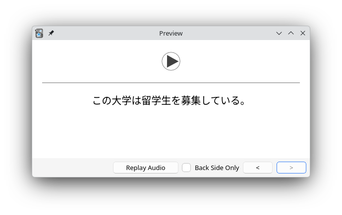

# Anki tools for language learning

A modular collection of tools and scripts to enhance your anki-based language learning. These tools focus on listening, sentence mining, sentence decks, and more. Built for language learners and immersion enthusiasts with linux knowledge. 

### Tools Overview

| Tool                            | Purpose                                                                 |
|---------------------------------|-------------------------------------------------------------------------|
| `audio-extractor`     | Extract Anki card audio by language into playlists for passive listening |
| `batch_importer`      | Generate TTS audio from sentence lists and import into Anki             |
| `word-scraper`        | Extract & lemmatize words from Anki decks (frequency analysis, mining)  |
| `yt-transcript`       | Mine vocabulary/sentences from YouTube transcripts for analysis         |
| `deck-converter`*     | Convert TSV+audio into `.apkg` Anki decks using config-driven workflow  |
| `youtube-to-anki`*    | Convert YouTube subtitles/audio into fully timestamped Anki cards       |

*=haven't used these tools in a very long time and will update them when I use them again

### Requirements

Each tool has its own set of dependencies. Common dependencies includes
- Python3
- [Anki](https://apps.ankiweb.net/) with [AnkiConnect](https://github.com/amikey/anki-connect)
- `yt-dlp`, `jq`, `yq`, `spaCy`, `gTTS`, `youtube-transcript-api`, `pyyaml`, `genanki`, `fugashi`, `regex`, `requests`
- `ffmpeg`

Personally, I like to have on venv that contains all the prerequisites. 

```shell
python3.12 -m venv ~/.venv/anki-tools
source ~/.venv/anki-tools/bin/activate
python3 -m pip install -U pip
pip install gtts jq yq spacy youtube-transcript-api pyyaml genanki fugashi regex requests

# Also install ffmpeg
sudo dnf install ffmpeg
```
That way, whenever you want to run these scripts, you can just source the venv and run the appropriate script.

```shell
source ~/.venv/anki-tools/bin/activate
```

### Getting started

Clone the repository:
```shell
git clone https://git.pawelsarkowicz.xyz/ps/anki-tools.git
cd anki-tools
```
Then explore. 

Most scripts assume:
- Anki is running
- the AnkiConnect add-on is enabled (default: http://localhost:8765)
- that your anki cards are basic, with audio on the front and the sentence (in the target language) on the back. These tools only look at the first line of the back, so you can have notes/translations/etc. on the following lines if you like.


### Language support
- 🇯🇵 日本語
- 🇪🇸 Español


## audio-extractor
**Purpose**: Extract audio referenced by `[sound:...]` tags from Anki decks, grouped by language.

### Usage:

```bash
./extract_anki_audio.py jp [--concat] [--outdir DIR] [--copy-only-new]
./extract_anki_audio.py es [--concat] [--outdir DIR] [--copy-only-new]
```

Outputs:
- Copies audio into `~/Languages/Anki/anki-audio/<language>/` by default
- Writes `<language>.m3u`
- With `--concat`, writes `<language>_concat.mp3` (keeps individual files)

### Requirements
- Anki + AnkiConnect
- `requests`
- `ffmpeg` (only if you use `--concat`)

## batch_importer
**Purpose**: Generate TTS audio from a sentence list and add notes to Anki via AnkiConnect.

### Usage

```bash
./batch_anki_import.sh [jp|es] [--concat] [--outdir DIR]
```

- Keeps all individual MP3s.
- If `--concat` is passed, also writes one combined MP3 for the run.

### Requirements
- Anki + AnkiConnect
- `gtts-cli`, `ffmpeg`, `curl`

### Sentence files
- Japanese: `~/Languages/Anki/sentences_jp.txt`
- Spanish: `~/Languages/Anki/sentences_es.txt`

## word-scraper

Extract frequent words from Anki notes using **AnkiConnect** and **spaCy**.
This is primarily intended for language learning workflows (currently Japanese and Spanish).

The script:
- queries notes from Anki
- extracts visible text from a chosen field
- tokenizes with spaCy
- filters out stopwords / grammar
- counts word frequencies
- writes a sorted word list to a text file


### Requirements

- Anki + AnkiConnect - Python **3.12** (recommended; spaCy is not yet stable on 3.14)
- `spacy`, `regex`, `requests`
- spaCy models:
```bash
python -m spacy download es_core_news_sm
python -m spacy download ja_core_news_lg
```

### Usage
```bash
./word_scraper.py {jp,es} [options]
```

| Option                | Description                                                          |
| --------------------- | -------------------------------------------------------------------- |
| `--query QUERY`       | Full Anki search query (e.g. `deck:"Español" tag:foo`)               |
| `--deck DECK`         | Deck name (repeatable). If omitted, decks are inferred from language |
| `--field FIELD`       | Note field to read (default: `Back`)                                 |
| `--min-freq N`        | Minimum frequency to include (default: `2`)                          |
| `--outdir DIR`        | Output directory (default: `~/Languages/Anki/anki-words/<language>`)      |
| `--out FILE`          | Output file path (default: `<outdir>/words_<lang>.txt`)              |
| `--full-field`        | Use full field text instead of only the first visible line           |
| `--spacy-model MODEL` | Override spaCy model name                                            |
| `--logfile FILE`      | Log file path                                                        |

### Examples
#### Basic usage (auto-detected decks)
```bash
./word_scraper.py jp
./word_scraper.py es
```

#### Specify a deck explicitly
```bash
./word_scraper.py jp --deck "日本語"
./word_scraper.py es --deck "Español"
```

#### Use a custom Anki query
```bash
./word_scraper.py es --query 'deck:"Español" tag:youtube'
```

#### Change output location and frequency threshold
```bash
./word_scraper.py jp --min-freq 3 --out words_jp.txt
./word_scraper.py es --outdir ~/tmp/words --out spanish_words.txt
```

#### Process full field text (not just first line)
```bash
./word_scraper.py jp --full-field
```

### Output format
The output file contains one entry per line:
```
word frequency
```
Examples:
```
comer 12
hablar 9
行く (行き) 8
見る (見た) 6
```

- Spanish output uses lemmas
- Japanese output includes lemma (surface) when they differ

### Language-specific notes
#### Japanese
- Filters out particles and common grammar
- Keeps nouns, verbs, adjectives, and proper nouns
- Requires `regex` for Unicode script matching

#### Spanish
- Filters stopwords
- Keeps alphabetic tokens only
- Lemmatized output

## yt-transcript 
Extract vocabulary or sentence-level text from YouTube video subtitles (transcripts), for language learning or analysis.

The script:
- fetches captions via `youtube-transcript-api`
- supports **Spanish (es)** and **Japanese (jp)**
- tokenizes Japanese using **MeCab (via fugashi)**
- outputs either:
  - word frequency lists, or
  - timestamped transcript lines

### Features

- Extract full vocabulary lists with frequency counts
- Extract sentences (with timestamps or sentence indices)
- Support for Japanese tokenization
- Optional: stopword filtering
- Modular and extendable for future features like CSV export or audio slicing

### Requirements
- `youtube-transcript-api`
- For Japanese tokenization:
```
pip install "fugashi[unidic-lite]"
```

### Usage
```shell
./yt-transcript.py {jp,es} <video_url_or_id> [options]
```

### Options
| Option                     | Description                            |
| -------------------------- | -------------------------------------- |
| `--mode {vocab,sentences}` | Output mode (default: `vocab`)         |
| `--top N`                  | Show only the top N words (vocab mode) |
| `--no-stopwords`           | Keep common words                      |
| `--raw`                    | (Spanish only) Do not lowercase tokens |


### Examples
#### Extract Spanish vocabulary
```bash
./yt-transcript.py es https://youtu.be/VIDEO_ID
```

#### Top 50 words
```bash
./yt-transcript.py es VIDEO_ID --top 50
```

#### Japanese transcript with timestamps
```bash
./yt-transcript.py jp VIDEO_ID --mode sentences
```

#### Keep Spanish casing and stopwords
```bash
./yt-transcript.py es VIDEO_ID --raw --no-stopwords
```

### Output formats
#### Vocabulary mode
```
palabra: count
```
Example:
```
comer: 12
hablar: 9
```

#### Sentence mode
```
[12.34s] sentence text here
```
Example:
```
[45.67s] 今日はいい天気ですね
```

### Language Notes
#### Spanish
- Simple regex-based tokenizer
- Accented characters supported
- Lowercased by default

#### Japanese
- Uses fugashi (MeCab)
- Outputs surface forms
- Filters via stopword list only (no POS filtering)

# License
